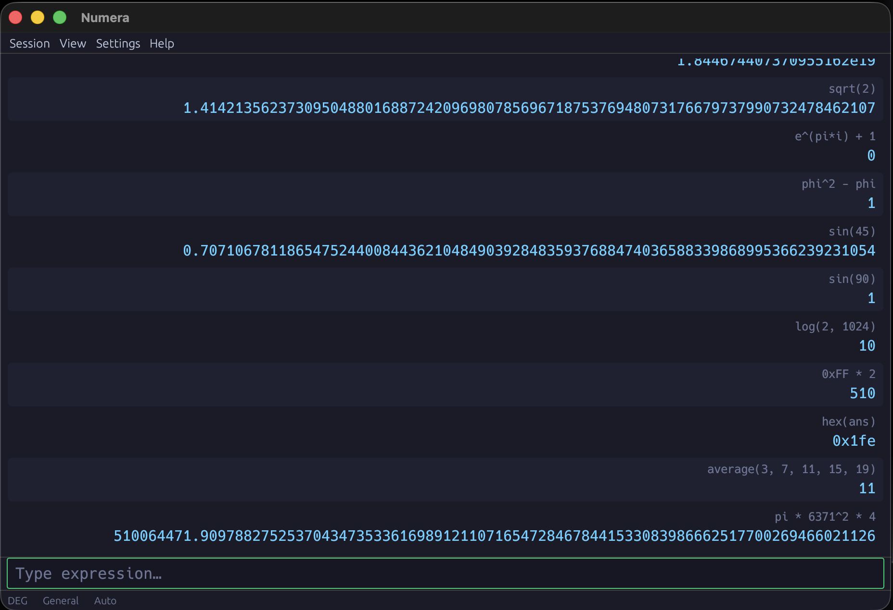

<p align="center">
  
</p>

<h1 align="center">Numera</h1>

<p align="center">
  A high-precision scientific calculator written in Rust with an <a href="https://github.com/emilk/egui">egui</a> GUI.
</p>

<p align="center">
  
</p>

## Features

### Math Engine
- High-precision floating-point arithmetic (exact rational arithmetic)
- Multiple number formats: decimal, hexadecimal (`0x`), octal (`0o`), binary (`0b`)
- Full operator precedence with parentheses
- Postfix operators: factorial (`!`), percent (`%`)
- Power operator (`^` / `**`, right-associative)
- Bitwise operators: `&`, `|`, `~`, `<<`, `>>`
- Complex number support (`2+3i`)

### 67+ Built-in Functions

| Category | Functions |
|---|---|
| **Analysis** | `abs`, `average`, `bin`, `cbrt`, `ceil`, `dec`, `floor`, `frac`, `gamma`, `geomean`, `hex`, `int`, `lngamma`, `max`, `min`, `oct`, `product`, `round`, `sgn`, `sqrt`, `sum`, `trunc` |
| **Logarithm & Hyperbolic** | `arcosh`, `arsinh`, `artanh`, `cosh`, `exp`, `lg`, `ln`, `log` (`log(x)` or `log(base, x)`), `sinh`, `tanh` |
| **Discrete** | `gcd`, `ncr`, `npr` |
| **Probability** | `binompmf`, `binomcdf`, `binommean`, `binomvar`, `erf`, `erfc`, `hyperpmf`, `hypercdf`, `hypermean`, `hypervar`, `poissonpmf`, `poissoncdf`, `poissonmean`, `poissonvar` |
| **Trigonometry** | `acos`, `asin`, `atan`, `cos`, `cot`, `csc`, `degrees`, `radians`, `sec`, `sin`, `tan` |
| **Logic** | `and`, `idiv`, `mask`, `mod`, `not`, `or`, `sgnext`, `shl`, `shr`, `xor` |

### 45+ Physical Constants
Organized by category: General Physics, Electromagnetic, Atomic & Nuclear, Physico-chemical, Astronomy.

### Expression Evaluator
- Shunting-yard algorithm with full operator precedence
- Variable assignment (`x = 42`)
- Built-in constants: `pi`, `e`, `phi`
- `ans` variable (last result)
- Auto-close parentheses
- Case-insensitive function/variable names

### GUI (egui)
- **Dark theme** — Tokyo-Night inspired colour palette
- **Terminal-style layout** — history grows upward, input pinned at the bottom
- **Result display** — scrollable history with click-to-reinsert
- **Live preview** — see the result as you type
- **On-screen keypad** — toggle-able buttons for touch/mouse input
- **Side panels** — Constants, Functions, Variables (filterable)
- **Menus** — Session, View, Settings, Help
- **Settings** — result format, angle mode, precision, radix character
- **Session persistence** — history, variables, and settings saved automatically
- **About dialog** with logo

### Keyboard

| Key | Action |
|---|---|
| `Enter` | Evaluate |
| `↑` / `↓` | Navigate history |

## Getting Started

```bash
# Clone
git clone https://github.com/pedrosantospt/numera.git
cd numera

# Run
cargo run

# Build release binary
cargo build --release

# Run tests
cargo test
```

### Pre-built binaries

Download from [Releases](https://github.com/pedrosantospt/numera/releases).

**macOS note:** Since the binary is not signed with an Apple Developer certificate, macOS Gatekeeper will block it. To allow it, run:

```bash
xattr -cr numera
chmod +x numera
./numera
```

## Project Structure

```
numera/
├── Cargo.toml
├── README.md
└── src/
    ├── lib.rs               # Library crate (module declarations)
    ├── main.rs              # Binary entry point
    ├── math.rs              # HNumber type & math operations
    ├── tokenizer.rs         # Expression tokenizer
    ├── evaluator.rs         # Shunting-yard parser & evaluator
    ├── constants.rs         # Physical constants (45+, 5 categories)
    ├── functions.rs         # Built-in functions (67+, 6 categories)
    ├── settings.rs          # Settings with JSON persistence
    ├── history.rs           # HistoryEntry value object
    ├── gui/
    │   ├── mod.rs           # App state & eframe wiring
    │   ├── theme.rs         # Tokyo-Night colour constants
    │   ├── editor.rs        # Expression input state
    │   ├── result_display.rs# Scrollable history renderer
    │   ├── keypad.rs        # On-screen calculator keypad
    │   ├── panels.rs        # Constants/Functions/Variables panels
    │   ├── menu_bar.rs      # Top-level menu bar
    │   ├── status_bar.rs    # Bottom status bar
    │   └── about.rs         # About dialog with logo
    └── resources/
        └── logo.png         # Application icon
```

## Dependencies

- [egui](https://github.com/emilk/egui) / [eframe](https://docs.rs/eframe) — immediate-mode GUI
- [image](https://docs.rs/image) — PNG decoding for the logo
- [serde](https://serde.rs) / serde_json — settings serialization
- [dirs](https://docs.rs/dirs) — cross-platform config paths
- [num](https://docs.rs/num) — arbitrary-precision numeric types
- [arboard](https://docs.rs/arboard) — clipboard access

## License

GPL-2.0-or-later

Inspired by [SpeedCrunch](http://speedcrunch.org).
